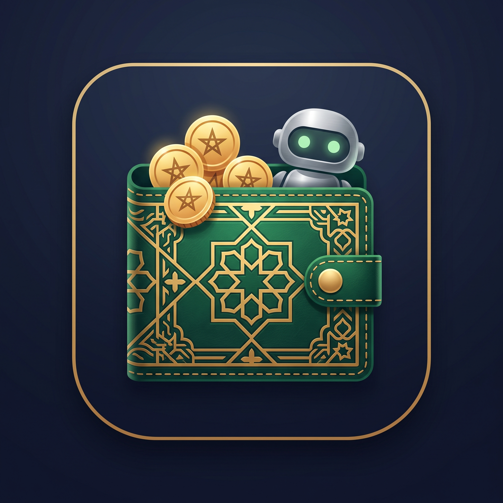

# 🇲🇦 Mahfazati • محفظتي — Mon Portefeuille Marocain Intelligent

<div align="center">
  

  <h3>Dépense moins. Atteins plus. • صرّف بذكاء، وفّر أكثر</h3>
  <p>Application mobile marocaine de gestion de budget personnel et de coaching financier propulsée par l'IA (Google Gemini).</p>

  <p>
    
    
    
    
    
    
  </p>
</div>

---

## 📖 Sommaire
1. [À propos](#-à-propos)
2. [Fonctionnalités Clés](#-fonctionnalités-clés)
3. [Expérience Culturelle Marocaine](#-expérience-culturelle-marocaine)
4. [Stack Technique](#-stack-technique)
5. [Structure du Projet](#-structure-du-projet)
6. [Installation & Démarrage](#-installation--démarrage)
7. [Génération du fichier APK Android](#-génération-du-fichier-apk-android)
8. [Configuration de l'IA (Google Gemini)](#-configuration-de-lia-google-gemini)
9. [Sécurité & Confidentialité](#-sécurité--confidentialité)
10. [Licence](#-licence)

---

## 🌟 À propos

**Mahfazati** (*محفظتي*) est une application mobile moderne conçue spécifiquement pour répondre aux réalités économiques et habitudes financières au Maroc.

Contrairement aux applications bancaires traditionnelles complexes, Mahfazati simplifie la gestion de l'argent :
- **Synchronisation mathématique** : `Budget Quotidien Disponible = Salaire Net - (Loyer + Charges Fixes + Épargne Visée)`.
- **Zéro friction** : Ajout d'une dépense en 3 secondes (Cash, Carte ou Virement).
- **Coach IA bienveillant** : Analyse vos habitudes en Darija marocaine ou en Français avec des conseils concrets.

---

## ✨ Fonctionnalités Clés

### ⚡ 1. Compteur de Rythme Budgétaire (Budget Speedometer)
- Indicateur visuel circulaire en direct de l'état de votre budget.
- Calcule automatiquement le **Rythme journalier conseillé** (*Combien puis-je dépenser par jour jusqu'à la fin du mois sans être à découvert*).
- Gestion précise de l'arrondi et affichage neutre `0 MAD` sans valeurs négatives erronées.

### 🤖 2. Coach Financier IA (Google Gemini 2.5 Flash-Lite)
- Génère des diagnostics personnalisés et des plans d'action correctifs immédiats.
- Bilingue : Parle couramment la **Darija marocaine** (*"Rak wa3er ! Bsahtek"* / *"3ndak lmssrouf dyal lqahwa"*...) et le **Français**.
- **Cache intelligent anti-surconsommation** : L'IA n'est sollicitée que lors de l'ajout réel d'une dépense. Aucune requête inutile n'est émise lors de la navigation entre onglets pour préserver le quota gratuit.
- **Bascule automatique (Fallback)** : Fonctionne à 100% même hors-ligne grâce au moteur algorithmique local intégré.

### 🛍️ 3. Gestion du Souk & Catégories Personnalisées
- **Alimentation & Souk (`ماكلة وتقضية`)** : Pensé pour intégrer le panier du Souk / Marché (fruits, légumes, viande, hanout) en plus des repas.
- **Créateur de catégories sur mesure (`+ Nouvelle catégorie`)** : Ajoutez vos propres catégories spécifiques (*Daret / Tontine, Animaux, Bricolage, Salle de sport, Cadeaux...*) avec sélection d'icônes et de couleurs personnalisées.

### 🎯 4. Motifs de Dépense (Purpose / Why)
- Suggestions rapides en 1 clic selon la catégorie choisie :
  - *Alimentation* $\rightarrow$ `Souk / Légumes`, `Hanout / Épicerie`, `Café / Qahwa`, `Restaurant`, `Snack`.
  - *Transport* $\rightarrow$ `Gazole / Essence`, `Grand Taxi`, `Petit Taxi`, `Tramway / Bus`, `Péage`.
  - *Factures* $\rightarrow$ `Électricité & Eau (Lydec/Redal)`, `Wifi & Internet`, `Recharge téléphone`, `Syndic`.
  - *Santé* $\rightarrow$ `Pharmacie`, `Médecin`, `Dentiste`, `Analyses`.
- Champ de saisie libre pour préciser l'achat (*ex: "Souk de Sidi Othman", "Réparation pneu"*), transmis au Coach IA pour des recommandations ultra-contextualisées.

### 📊 5. Rapports & Statistiques Interactives
- Diagramme de répartition par catégorie avec pourcentages en temps réel.
- Comparatif des moyens de paiement : **Cash (كاش)** vs **Carte & Virement (كارطة وفيرمون)**.

### 🎨 6. Design Dark Mode Premium & Ergonomie
- Thème sombre profond (`#060B10`) évitant toute fatigue oculaire.
- **Splash Screen sans flash blanc** avec logo officiel centré.
- Respect strict des **Safe Areas Android** : Les 5 onglets et les boutons d'action sont surélevés au-dessus de la barre de navigation Android (3 boutons / gestes).

---

## 🇲🇦 Expérience Culturelle Marocaine

| Catégorie Standard | Nom en Darija | Exemples typiques |
| :--- | :--- | :--- |
| **Alimentation & Souk** | ماكلة وتقضية | Souk hebdomadaire, Hanout, Boucherie, Café |
| **Transport & Trajet** | طريق ونقل | Gazole, Grand Taxi, Tramway, Péage |
| **Factures & Charges** | فواتير ومصاريف | Lydec, Redal, Radeema, Inwi, IAM, Orange, Syndic |
| **Logement & Loyer** | كراء وسكن | Loyer mensuel, Plomberie, Entretien |
| **Santé & Pharmacie** | صحة ودوا | Pharmacie, Consultation docteur, Analyses |
| **Loisirs & Perso** | نشاط وخاص | Hwayej, Hajjamat/Coiffeur, Salle de sport |
| **Famille & Enfants** | عائلة ودار | École, Daret / Tontine, Eid, Dépenses enfants |

---

## 🛠️ Stack Technique

- **Framework** : [React Native](https://reactnative.dev/) (0.86.3) avec [Expo](https://expo.dev/) (SDK 57)
- **Moteur JS** : Hermes Engine (haute performance, démarrage instantané)
- **Intelligence Artificielle** : Google Gemini API (`gemini-2.5-flash-lite`, `gemini-3.5-flash-lite`, `gemini-1.5-flash`)
- **Stockage Local** : [@react-native-async-storage/async-storage](https://github.com/react-native-async-storage/async-storage)
- **Composants Système & Safe Area** : `react-native-safe-area-context`, `expo-splash-screen`, `expo-status-bar`, `expo-navigation-bar`
- **Icônes** : `@expo/vector-icons` (Feather, Ionicons, MaterialCommunityIcons)

---

## 📁 Structure du Projet

```text
mahfazati/
├── assets/                       # Icônes officielles, logo et splash screen
│   ├── app-logo.png              # Logo officiel de l'application
│   ├── adaptive-icon.png         # Icône adaptative Android
│   └── splash-icon.png           # Écran de démarrage
├── src/
│   ├── components/               # Composants React Native modulaires
│   │   ├── AppIcon.js            # Moteur unifié d'icônes vectorielles
│   │   ├── BudgetSpeedometer.js  # Jauge circulaire de budget
│   │   ├── CategoryBreakdown.js  # Statistiques de dépenses par catégorie
│   │   ├── CoachCard.js          # Carte du Coach IA avec actions interactives
│   │   ├── Header.js             # En-tête avec avatar et branding
│   │   ├── OnboardingScreen.js   # Parcours d'initialisation en 5 étapes
│   │   ├── ProfileScreen.js      # Profil utilisateur et salaire
│   │   ├── QuickAddModal.js      # Modal d'ajout de dépense avec suggestions
│   │   ├── SettingsScreen.js     # Réglages, clé API Gemini & thème
│   │   └── TransactionList.js    # Historique des transactions
│   ├── data/
│   │   └── mockData.js           # Catégories marocaines, suggestions & traductions
│   ├── services/
│   │   ├── aiCoach.js            # Intégration Gemini AI & système de cache
│   │   └── coachEngine.js        # Moteur de règles financières local (hors-ligne)
│   ├── storage/
│   │   └── asyncStore.js         # Gestion de la persistance locale (AsyncStorage)
│   └── theme/
│       └── colors.js             # Palette de couleurs (Dark & Light)
├── App.js                        # Composant racine & navigation principale
├── app.json                      # Configuration Expo & permissions natives
├── eas.json                      # Configuration de compilation APK (EAS Build)
├── index.js                      # Point d'entrée standard de l'application
└── package.json                  # Dépendances du projet
```

---

## 🚀 Installation & Démarrage

### Prérequis
- [Node.js](https://nodejs.org/) (version 18 ou supérieure recommandée)
- Un smartphone Android avec l'application **Expo Go** ou un émulateur Android.

### 1. Cloner le dépôt
```bash
git clone https://github.com/votre-nom-utilisateur/mahfazati.git
cd mahfazati
```

### 2. Installer les dépendances
```bash
npm install
```

### 3. Lancer le serveur de développement
```bash
npx expo start -c
```
- Scannez le **QR Code** avec l'application **Expo Go** sur votre téléphone Android.
- Ou appuyez sur `a` pour lancer sur l'émulateur Android.
- Ou appuyez sur `w` pour tester dans le navigateur web.

---

## 📲 Génération du fichier APK Android

Vous pouvez générer le fichier installable `.apk` de deux manières :

### Méthode 1 : Via EAS Build (Cloud gratuit)
```bash
# 1. Se connecter à Expo
npx eas login

# 2. Lancer la compilation de l'APK
npx eas build -p android --profile preview
```

### Méthode 2 : Compilation locale sur votre PC (avec Android Studio)
```bash
# 1. Pré-générer les dossiers natifs
npx expo prebuild --clean

# 2. Compiler en mode Release
cd android
.\gradlew assembleRelease
```
> Le fichier APK sera généré dans :  
> `android/app/build/outputs/apk/release/app-release.apk`

---

## 🔑 Configuration de l'IA (Google Gemini)

L'utilisation de l'intelligence artificielle est **100% optionnelle et gratuite** :
1. Obtenez votre clé API gratuite en 30 secondes sur [Google AI Studio](https://aistudio.google.com/apikey).
2. Ouvrez l'application **Mahfazati** $\rightarrow$ Onglet **Réglages** (*Paramètres*).
3. Collez votre clé dans le champ **Clé API Gemini**.
4. Le Coach IA s'active instantanément avec le modèle rapide `gemini-2.5-flash-lite` !

---

## 🔒 Sécurité & Confidentialité

- **100% Stockage Local** : Vos revenus, transactions et données personnelles sont enregistrés exclusivement dans la mémoire sécurisée de votre téléphone (`AsyncStorage`).
- **Aucun serveur intermédiaire** : Aucune donnée financière n'est transmise à des tiers.
- **Protection de l'IA** : Seul le résumé anonymisé des catégories est envoyé à Google lors de la génération d'un conseil.

---

## 📄 Licence

Ce projet est sous licence **MIT**. Vous êtes libre de l'utiliser, le modifier et le distribuer.

---

<div align="center">
  <b>Développé avec fierté pour le Maroc 🇲🇦</b><br/>
  <i>Mahfazati — Prenez le contrôle de vos finances en toute simplicité.</i>
</div>
